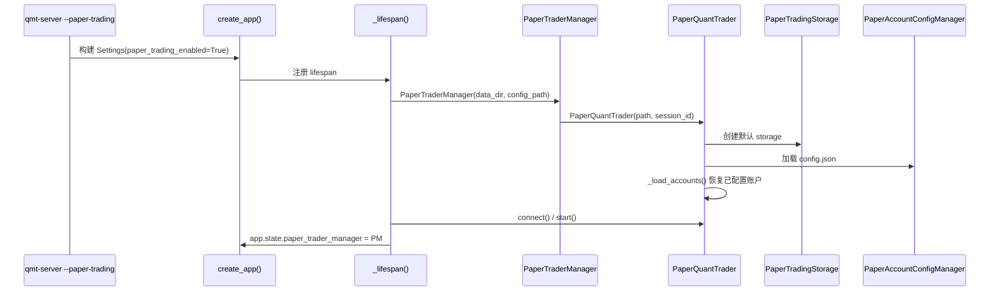
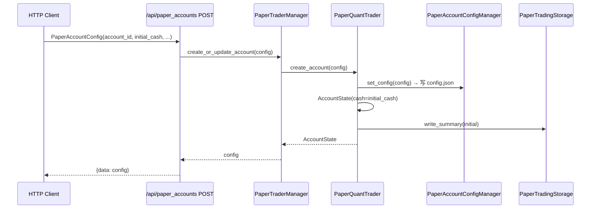
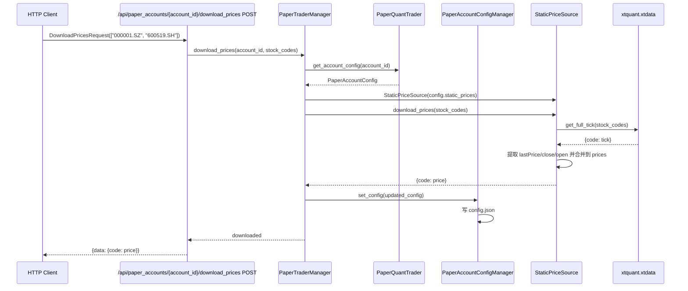
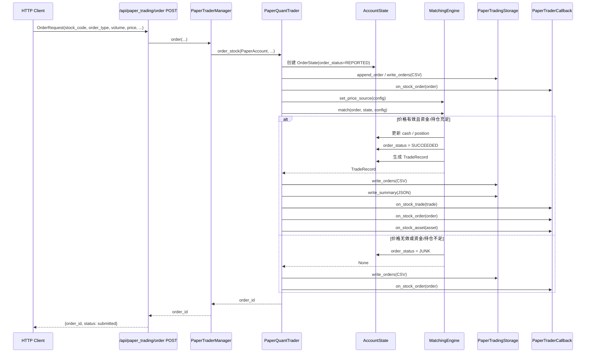
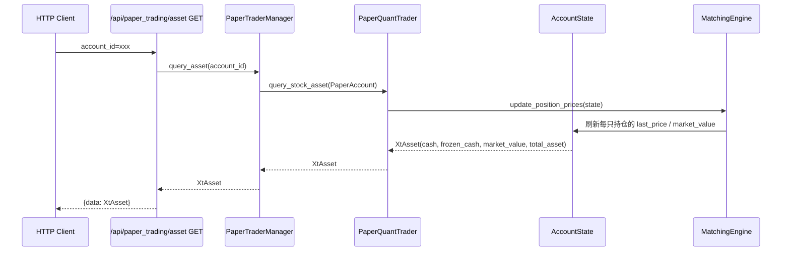
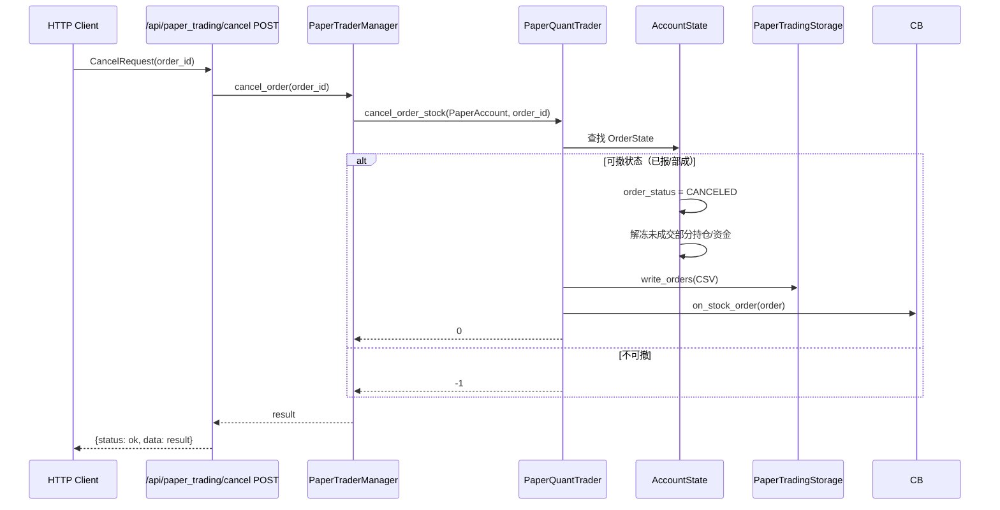
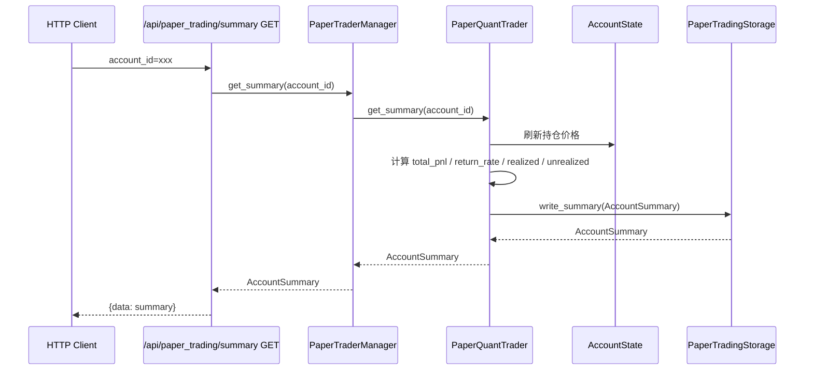

# 模拟交易（Paper Trading）

QMT Bridge 的模拟交易模块提供一套与真实 `xtquant.xttrader` API 完全对齐的本地模拟实现，
无需连接 QMT 客户端即可进行下单、撤单、查询、复盘。每个账户独立管理资金、持仓、委托与成交，
所有委托自动写入 CSV，业绩自动汇总为 JSON。

## 适用场景

- 策略回测与验证：在真实交易前验证下单逻辑与风控。
- 无 QMT 环境开发：在 Mac / Linux 开发机上调试交易代码。
- 多账户模拟：同时维护多个虚拟资金账号，互不干扰。

## 启用方式

### CLI

```bash
# 仅启用模拟交易（无需 QMT 客户端）
qmt-server --paper-trading --api-key your-secret-key

# 同时启用真实交易与模拟交易
qmt-server --trading --paper-trading --api-key your-secret-key \
  --mini-qmt-path "C:\国金QMT交易端\userdata_mini" --account-id 12345678
```

### 环境变量

| 环境变量 | 默认值 | 说明 |
|---------|-------|------|
| `QMT_BRIDGE_PAPER_TRADING_ENABLED` | `false` | 是否启用模拟交易模块 |
| `QMT_BRIDGE_PAPER_TRADING_DATA_DIR` | `./data/paper_trading` | 数据目录 |
| `QMT_BRIDGE_PAPER_TRADING_CONFIG_PATH` | _(空)_ | 配置文件路径（可选） |

## 整体架构

```text
┌─────────────────────────────────────────────────────────────────────┐
│                         HTTP Client / 策略                          │
└─────────────────────────────────┬───────────────────────────────────┘
                                  │ HTTP / JSON
┌─────────────────────────────────▼───────────────────────────────────┐
│                     FastAPI Router (/api/paper_*)                   │
│  /api/paper_accounts/*   /api/paper_trading/*   /api/paper_trading  │
│  (账户配置管理)          (交易操作)               /summary /summaries│
└─────────────────────────────────┬───────────────────────────────────┘
                                  │
┌─────────────────────────────────▼───────────────────────────────────┐
│                   PaperTraderManager (lifespan)                     │
│  - 维护 PaperQuantTrader 生命周期                                   │
│  - 暴露账户配置、下单、撤单、查询、业绩汇总接口                      │
└─────────────────────────────────┬───────────────────────────────────┘
                                  │
┌─────────────────────────────────▼───────────────────────────────────┐
│                      PaperQuantTrader                               │
│  - 多账户状态容器 (_accounts: dict[str, AccountState])              │
│  - 自增 order_id / traded_id / seq                                  │
│  - 注册并触发 PaperTraderCallback 回调                              │
└──────┬─────────────────────┬──────────────────────┬─────────────────┘
       │                     │                      │
       ▼                     ▼                      ▼
┌──────────────┐   ┌─────────────────┐   ┌──────────────────────┐
│ PaperAccount │   │ MatchingEngine  │   │ PaperAccountConfig   │
│ ConfigManager│   │ - PriceSource   │   │ - initial_cash       │
│ - config.json│   │ - 撮合/手续费   │   │ - commission_rate    │
└──────────────┘   └─────────────────┘   │ - stamp_tax_rate     │
                                         │ - slippage           │
                                         │ - price_source       │
                                         └──────────────────────┘
       │                     │                      │
       ▼                     ▼                      ▼
┌──────────────┐   ┌───────────────────────────┐   ┌──────────────────────┐
│ AccountState │   │ {account_id}/order/       │   │ {account_id}/summary/│
│ - cash       │   │ orders_{YYYYMMDD}.csv     │   │ summary.json         │
│ - positions  │   │ (委托流水)                 │   │ - total_asset        │
│ - orders     │   └───────────────────────────┘   │ - total_pnl          │
│ - trades     │                                   │ - realized_pnl       │
└──────────────┘                                   │ - unrealized_pnl     │
                                                   └──────────────────────┘
```

## 模块职责

| 模块 | 文件 | 职责 |
|-----|------|------|
| `PaperAccount` | `papertrader.py` | 模拟证券账号，对外暴露 `account_id` / `account_type` |
| `PaperQuantTrader` | `papertrader.py` | 核心交易器，实现与 `XtQuantTrader` 对齐的全部方法 |
| `PaperTraderManager` | `manager.py` | 生命周期包装器，与 `XtTraderManager` 形态一致 |
| `AccountState` | `account.py` | 单账户运行时状态（资金、持仓、委托、成交） |
| `MatchingEngine` | `engine.py` | 撮合引擎，处理价格源、滑点、手续费、持仓更新 |
| `PaperTradingStorage` | `storage.py` | CSV 委托流水与 JSON 业绩摘要持久化 |
| `PaperAccountConfigManager` | `config.py` | 账户级配置管理（初始资金、费率、价格源等） |
| `router.py` | `router.py` | FastAPI 路由：`/api/paper_accounts/*`、`/api/paper_trading/*` |

## 调用流程

### 1. 启动阶段



### 2. 创建/更新账户



### 3. 下载静态价格

当使用 `static` 或 `fallback` 价格源时，可通过 xtquant 接口批量下载最新行情并写入账户的 `static_prices`，免去手动维护价格表。



请求示例：

```bash
curl -X POST "http://localhost:8000/api/paper_accounts/acc001/download_prices" \
  -H "X-API-Key: your-secret-key" \
  -H "Content-Type: application/json" \
  -d '{"stock_codes": ["000001.SZ", "600519.SH"]}'
```

响应示例：

```json
{
  "data": {
    "000001.SZ": 12.34,
    "600519.SH": 567.89
  }
}
```

说明：

- 仅下载成功的股票会出现在响应中；失败股票会被跳过并记录 warning 日志。
- 下载后的价格会自动保存到对应账户配置的 `static_prices`，后续 `static`/`fallback` 撮合将使用这些价格。
- 该端点依赖 xtquant，仅在 QMT 客户端可用时能成功取到行情。

### 4. 下单与撮合



### 5. 查询资产



### 6. 撤单



### 7. 业绩汇总



## 多账户隔离

每个 `account_id` 在 `PaperQuantTrader._accounts` 中对应独立的 `AccountState`，
包含独立的：

- `cash` / `initial_cash`
- `positions: dict[str, PositionState]`
- `orders: dict[int, OrderState]`
- `trades: list[TradeRecord]`

账户级配置（`PaperAccountConfig`）也按 `account_id` 隔离，
存储在 `data/paper_trading/config.json` 中。

```json
{
  "acc001": {
    "account_id": "acc001",
    "account_type": 2,
    "initial_cash": 100000.0,
    "commission_rate": 0.0003,
    "stamp_tax_rate": 0.0005,
    "slippage": 0.0,
    "price_source": "fallback",
    "static_prices": {"000001.SZ": 10.0},
    "partial_fill_enabled": false,
    "enabled": true
  }
}
```

## 数据文件

### 委托 CSV

路径：`{data_dir}/paper_trading/{account_id}/order/orders_{YYYYMMDD}.csv`

表头：

```csv
order_time,order_id,stock_code,order_type,order_volume,price_type,price,traded_volume,traded_price,order_status,status_msg,strategy_name,order_remark
```

### 业绩摘要 JSON

路径：`{data_dir}/paper_trading/{account_id}/summary/summary.json`

字段：

```json
{
  "account_id": "acc001",
  "initial_cash": 100000.0,
  "cash": 90000.0,
  "market_value": 10000.0,
  "total_asset": 100000.0,
  "total_pnl": 0.0,
  "total_return_rate": 0.0,
  "realized_pnl": 0.0,
  "unrealized_pnl": 0.0,
  "total_trades": 1,
  "total_commission": 3.0,
  "total_stamp_tax": 0.0
}
```

## 撮合规则

- **价格源优先级**：`xtdata` → `static` → `fallback`
  - `xtdata`：调用 `xtquant.xtdata.get_full_tick()` 获取最新价
  - `static`：使用 `PaperAccountConfig.static_prices` 中配置的固定价格
  - `fallback`：先尝试 `xtdata`，失败再使用 `static`
- **限价单**：以委托价成交（`price > 0` 且 `price_type == FIX_PRICE`）
- **市价/最新价单**：从价格源获取最新价
- **滑点**：买入成交价 `= 基准价 × (1 + slippage)`，卖出 `= 基准价 × (1 - slippage)`
- **手续费**：`成交金额 × commission_rate`
- **印花税**：`成交金额 × stamp_tax_rate`，仅卖出收取
- **成交方式**：当前版本默认整单成交；资金/持仓不足时委托标记为废单

## 回调事件

模拟交易支持 `PaperTraderCallback` 中定义的全部回调：

| 回调 | 触发时机 |
|-----|---------|
| `on_connected` | `connect()` 成功 |
| `on_stock_order` | 委托创建、成交、撤单、废单 |
| `on_stock_trade` | 成交发生时 |
| `on_stock_asset` | 下单/撤单/成交后资产变化 |
| `on_stock_position` | 持仓变化时 |
| `on_order_stock_async_response` | `order_stock_async()` 返回 seq 后 |
| `on_cancel_order_stock_async_response` | `cancel_order_stock_async()` 返回 seq 后 |

## 限制与占位行为

以下 `XtQuantTrader` 方法在模拟交易中保持签名兼容，但返回空结果或成功占位，
不抛出异常：

- 信用交易查询（`query_credit_detail`、`query_stk_compacts` 等）
- 资金/证券划转（`fund_transfer`、`secu_transfer`）
- 银证转账（`bank_transfer_*`）
- CTP 跨市场划转（`ctp_transfer_*`）
- SMT 约券（`smt_*`）
- 智能算法（`smart_algo_*`）
- 新股申购（`query_new_purchase_limit`、`query_ipo_data`）

## 与真实交易模块的关系

模拟交易模块与真实交易模块相互独立：

- 真实交易：`/api/trading/*`，依赖 QMT 客户端，由 `XtTraderManager` 处理。
- 模拟交易：`/api/paper_*`，不依赖 QMT 客户端，由 `PaperTraderManager` 处理。

两者可同时启用，分别通过 `app.state.trader_manager` 与 `app.state.paper_trader_manager` 注入路由。
